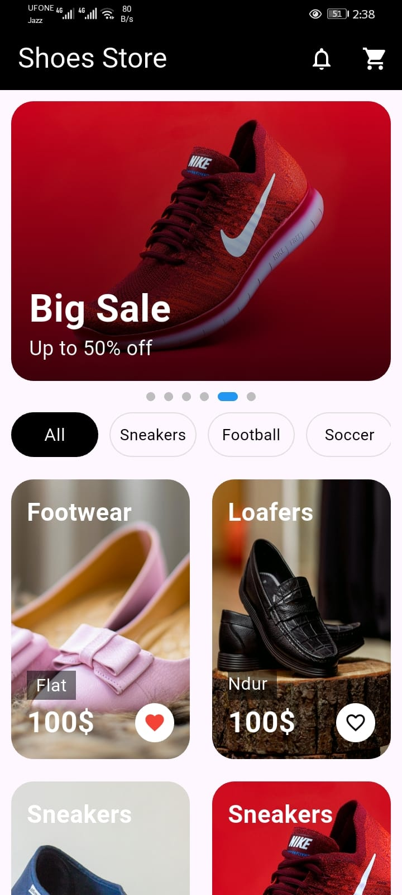
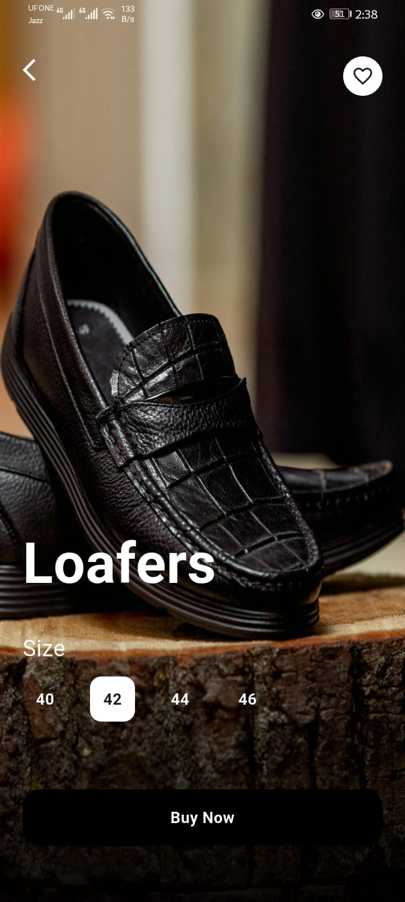

# 👟 Shoes Store UI (Flutter)

A modern and clean **Shoes Store UI** built with Flutter. This project showcases a simple e-commerce app flow with a strong focus on UI/UX, smooth navigation, and reusable components.

---

## ✨ Features

* 🏠 **Home Screen**

  * Hero section with carousel (featured shoes)
  * Grid view of shoes collection

* 👟 **Product Detail Screen**

  * Product preview with image
  * Price & description
  * Size selection UI
  * Buy now button

* 🛒 **Checkout Screen**

  * Order summary
  * Selected items display
  * Total price section
  * Checkout UI

* 🎨 **Modern UI**

  * Clean and minimal design
  * Smooth navigation
  * Responsive layout

---

## 📱 Screenshots

---

## 🛠️ Tech Stack

* Flutter
* Dart
* Material Design
* Carousel Slider

---

## 🧠 Learning Outcomes

* Flutter UI structuring
* GridView implementation
* Carousel integration
* Multi-screen navigation
* Reusable widgets

---

## 📌 Purpose

This project is built for practicing **Flutter UI development** and understanding how real-world e-commerce apps are structured.

---

## ⭐ Support

If you like this project, give it a star ⭐ on GitHub!
